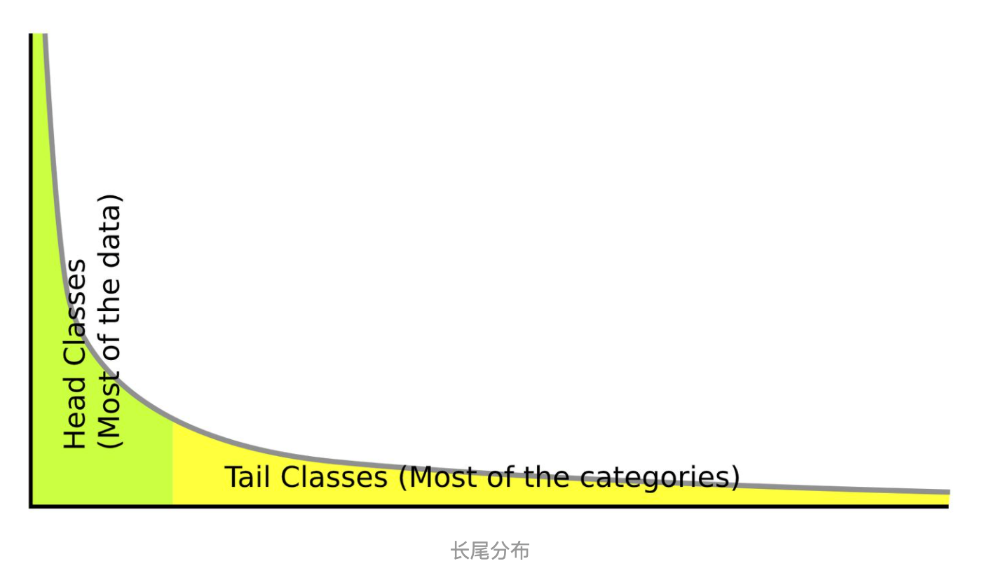

# 中期主要进展

**项目进展图：绿色：已完成，红色：产生的问题；黄色：正在实施；蓝色：已确定思路即将实施**

### 1. Web+WeChat+公开数据集制作

### 1.1 Web+weChat小程序开发

我们基于目标检测模型+分类模型+语义分割模型实现了一个端到端的智齿目标检测以及龋块分割标识功能，现已将最高精度模型部署至Web，客户端轻型模型的部署和嵌入式开发仍在进行中，web包括医生端口以及病患端口主要功能为端到端图像检测，辅助功能包括病人病历列表，医生任务列表，医生任务to-do list如图1所示Web展示视频于，微信小程序暂时只设计了demo如图2. 所示

### 1.2 公开数据集的以及医学数据库制作

目前由于医学道德问题导致的图像收集难度激增，相关公开牙科图像数据集储备几乎为0，为了获取项目训练数据，我们共获得包括温州附属第二医院，蒙恩牙科诊所，温州医学院在内的总计五家医院的助力，共获得20000张牙科全景X光片，部分院方授权书以及全景片样本于 https://github.com/Eric-jinkens/teethDease/tree/main/sample可见，但遗憾的是目前科研界对于医学道德伦理问题的重视，如果需要制作基准公开数据集，我们需要收集患者的知情同意书，目前多家医院正在帮助我们进行收集，授权书模板于 https://github.com/Ericjinkens/teethDease/blob/main/sample/可见

我们为公开数据集制作了医学生学习版本，辅助以一个简单的思维导图用于展示示例，思维导图结构如图3. 所示，但由于医学道德委员会的警告我们不得在未取得患者全部同意书的情况下公开任何图像，所以成型数据集在此处不方便展，后期我们将基于思维导图建立一个关于龋齿疾病的知识图谱，目的在于辅助医学生进行更好的学习示（以下样本全部为已取得同意书的部分图片中处理获得）

分类数据集中暂时包含2个标签（Caries，Health），每张图像当中包含一个完整的牙齿，原始数据总量为3000，Caries以及Health标签图像各自均有1500。图像格式为TIF，全部为RGB三通道图像，图像大小均调整为224×224，如图4. 所示

目标检测数据集中包含2个标签(Tooth, Wisdom)，分别代表牙齿以及阻生齿，数据集共包含图片630张，图片格式为TIF，全部为RGB三通道图像，图片大小3048×1372。Tooth标签个数8500，Wisdom标签个数300；原始图像和标注图像如图5. 所示

根据龋病进展累积牙釉质、牙本质、牙髓分为主要三类以及继发龋，具体表现如图6. 所示：

### 2. 目标检测模型进展

目标检测方面采用Faster R-CNN模型，利用不同的backbone进行试验，并且尝试在backbone上加入ECA-net注意力模块。目标检测的Model Zoo以及部分performance如下：

其中模型Precision的取值均为至少连续10次迭代的Train loss波动幅度小于0.01时停止迭代后最后一个精度值

模型训练方法参数以及训练设备如下：

训练过程中各模型mean loss如下图所示：

各个模型在验证集上的召回率与AP：

为了更近一步地测试模型在召回，准确率以及平均精度上的性能，我们分别绘制了Recall，Precision，AP vs.IoU曲线（右下角为加入ECAnet通道注意力机制）：

### 3. 分类模型进展

**主要目标：训练出服务器端模型（提升精度不计计算量）和客户端模型（牺牲部分精度减少计算量）**

PS.目前包括自行构建CvT-13，CvT-21的代码以及模型参数pth文件已全部开源

实验思路：

1. 由于对模型计算量的需求不同，我们将模型进行分类：Light，Middle，Heavy，如Table 1.所示

2. 我们搭建了当前轻型CNN的SOTA：GhostNet，并将论文中的GhostModule插入到了VGG系列和ResNet系列中并进行了对比试验，简要结果如Table 1.和图2-1所示，可见对于我们的数据集GhostModule适应的非常好，当前对于我们的数据集轻型模型SOTA为Ghost-Resnet-20

   ​																		            **Table 1. Experiment Model Zoo**

   | Model              | Acc.(%) | Category     | Weights(M) |
   | ------------------ | ------- | ------------ | ---------- |
   | GhostNet 0.5×      | 82.1    | Light CNN    | 1.3        |
   | GhostNet 1.0×      | 83.5    | Light CNN    | 3.9        |
   | GhostNet 1.5×      | 86.5    | Light CNN    | 7.8        |
   | MobileNetV3  Small | 81.5    | Light CNN    | 1.5        |
   | MobileNetV3  Large | 82.3    | Light CNN    | 4.2        |
   | GoogLeNet          | 89.3    | Light CNN    | 6.6        |
   | ResNet-20          | 89.2    | Middle CNN   | 11.2       |
   | ResNet-32          | 89.1    | Middle CNN   | 21.3       |
   | ResNet-44          | 89.5    | Middle CNN   | 23.5       |
   | ResNet-56          | 89.4    | Middle CNN   | 27.8       |
   | VGG-11             | 90.2    | Heavy  CNN   | 132.9      |
   | VGG-13             | 89.7    | Heavy  CNN   | 133.0      |
   | VGG-16             | 90.1    | Heavy  CNN   | 138.4      |
   | VGG-19             | 89.4    | Heavy  CNN   | 143.7      |
   | Ghost-VGG-11       | 90.7    | Light CNN    | 4.7        |
   | Ghost-VGG-13       | 90.3    | Light CNN    | 4.8        |
   | Ghost-VGG-16       | 90.2    | Light CNN    | 15.0       |
   | Ghost-VGG-19       | 90.3    | Middle CNN   | 10.2       |
   | Ghost-ResNet-20    | 90.7    | EX Light CNN | 0.14       |
   | Ghost-ResNet-32    | 89.1    | EX Light CNN | 0.24       |
   | Ghost-ResNet-44    | 90.1    | EX Light CNN | 0.34       |
   | Ghost-ResNet-56    | 90.2    | EX Light CNN | 0.45       |
   | ViT                | 88.6    | Transformer  | 53.5       |
   | TNT                | 88.3    | Transformer  | 20.4       |
   | CvT-13             | 91.1    | Transformer  | 19.98      |
   | CvT-21             | 90.2    | Transformer  | 31.54      |

3. 针对服务器端模型，除了当前主流的CNN模型之外，考虑到Transformer在全局建模能力上的优秀，我们借鉴了”**CvT:    Introducing Convolutions to Vision Transformers”**，当前其官方开源代码仍未发布，我们利用pytorch自行进行复现，代码已上传GitHub，我们将在论文作者的官方代码开源后重新进行实验，精度如Table 1.所示(蓝色为client model SOTA，红色为server model SOTA），与CNN SOTA对比试验如图2-2所示

   

   对比试验采用K=10的K折交叉折叠验证，优化算法采用Adam，初始学习率设置为0.0001，并采用余弦退火法来保证loss的平滑下降，对比试验采用华为云p100GPU，最大迭代次数设置为500，如Table 2. 所示

   ​                                             **Table 2. Localization network configuration of classification model** 

   | Training Option           | Value             |
   | ------------------------- | ----------------- |
   | Optimization Method       | Adam              |
   | Mini-Batch Size           | 128               |
   | K-Folder Cross Validation | K=10              |
   | Initial Learning Rate     | 1e-3              |
   | Learning Rate Schedule    | CosineAnnealingLR |
   | ETA-min                   | 0.00001           |
   | Max Epochs                | 500               |
   | Training Environment      | GPU 1×p100        |
   | Framework                 | PyTorch           |

4. 由于医学疾病检测任务的特殊性，单一使用Accuracy并不能完整的评判模型的优劣，我们对部分的模型的在验证集上的Recall（查全率），precision（查准率），PR曲线进行了分析对比，分别如Table 3. 图3.所示

   ​															**图3. Precision v.s. Recall of some classification models**

   

   根据来自温州附属第二医院口腔科主任陈丽芬女士的建议，医生们更加倾向于模型在判断时更加的激进即更倾向于将图片判断为正样例，我们首先在验证集上画出了混淆矩阵，如图4. 所示

   

   由混淆矩阵可见仍旧存在部分将龋齿误判为健康齿的可能性，随机我们调节了交叉损失熵函数中的class_weight,**将caries类别的weight调节为1.6之后**重新进行训练，所有模型的FN降低到了3%以下

5. **由于目标检测模型的performance上达到了非常高的水平，意味着我们不需要标注全景片就可以获得非常大量的无标签牙齿图像，我们引入了Mean Teacher半监督模型并借鉴了Semi-supervised Medical Image Classification with Relation-driven Self-ensembling Model”引入了sample relation consistency(SRC)进一步提取无标签样本的语义信息，我们基于论文自己实现了带有SRC的MT半监督模型，并将论文中作为backbone的densenet121更换为表现更加优秀的CvT-13，具体结构如图5.所示，成就了我们数据集上的state of art，最终精度达到了94.7%**

   

# 中期下一步计划

| **计划事宜**                                                 | **时间期限**   | **是否完成** |
| ------------------------------------------------------------ | -------------- | ------------ |
| 数据收集与标注，院方授权书                                   | 2020.9-2021.1  | 是           |
| Faster RCNN搭建，GhostNet等轻型CNN搭建实验                   | 2020.9-2021.1  | 是           |
| Faster RCNN注意力机制优化；ViT，TNT，CvT等Transformer系列模型实验 | 2021.1-2021.3  | 是           |
| MT L-SRC半监督系列模型搭建与实验                             | 2021.3-2021.5  | 是           |
| Web应用，微信小程序开发                                      | 2021.2-2021.5  | 是           |
| 半监督语义分割模型思路调研                                   | 2021.4-2021.5  | 是           |
| 扩充数据集标签，语义分割数据集标注                           | 2021.4-2021.6  | 正在进行     |
| 长尾分布问题的调研                                           | 2021.4-2021.7  | 正在进行     |
| 长尾分布问题模块化组件的开发和嵌入模型以及实验               | 2021.7-2021.8  | 尚未开始     |
| 半监督语义分割模型的调研，搭建以及实验                       | 2021.5-2021.6  | 正在进行     |
| Web应用，微信小程序测试部署                                  | 2021.5-2021.7  | 正在进行     |
| 病患知情授权书收集完成                                       | 2021.7         | 收集进行中   |
| 公开数据集的标准化以及接口编写以及实验                       | 2021.7-2021.8  | 尚未开始     |
| 医学生公开数据库图谱思维导图的优化，数据库的建立以及接口搭建 | 2021.7-2021.8  | 尚未开始     |
| 目标检测+分类模型（龋齿检测任务）论文撰写                    | 2021.4-2021.6  | 正在进行     |
| 公开数据集论文撰写(目标TMI)                                  | 2021.7-2021.9  | 尚未开始     |
| 半监督语义分割任务论文撰写(目标TMI)                          | 2021.6-2021.10 | 即将开始     |
| 长尾分布数据集任务论文撰写（目标CVPR）                       | 2021.8-2021.11 | 尚未开始     |

**1.**   **解决目标检测数据集呈现长尾分布的思路**

目标检测模块已经取得了十分不错的精度，AP值可以达到95%左右，然而由于数据集中有阻生齿，该类别的数量相对于牙齿极少，因此下一步首先要解决模型无法检测出阻生齿的难题。

对于这类长尾分布问题，之前的工作多是对样本进行重加权或者重采样，2020年Kaihua Tang1, Jianqiang Huang, Hanwang Zhang 提出了一种新的思路，通过消除动量不好的影响，但是训练过程中保持动量对于模型稳定性的贡献来解决长尾分布问题。这种方式通过优化分类层：

1. 在模型训练时，使用multi-head normalized classifier，每个类的计算如下：

   

   K是multi-head的数量，$\tau$和 $\gamma$作为超参数

2. 在模型训练时统计一个移动平均特征$\bar{x}$ , 其单位方向看作是特征对头部类的倾向方向；

3. 在测试时从logits中剔除认为对头部类过度倾向的部分：

   

4. 对background做特殊处理，计算方式如下：

   

   I=0代表background类，$p_i$是利用原始训练的logits计算出的概率， $q_i$是利用TED logits计算出的softmax后的概率

**作者给出了模型相关的所有源代码。因此下一步我们计划将这种方法用于我们的情景来缓解长尾分布带来的问题**

**2.  解决龋齿分类数据集长尾分布的思路**

长尾分布是对自然界中数据不均衡分布的一种表示，是指在人工无均衡、自然采集的情况下，数据样本在各类别上的分布往往呈现成一种长长的尾巴的形状，如下图所示：

我们对项目中已经处理好的三千多数据样本做了简单的统计，近似估计整个样本数据集的分布情况：

可以看到在数据集中，牙颈部和牙本质样本占据了绝大部份，整个数据集可以被近似地认为是呈长尾分布的。

长尾分布的本质是数据分布的不均衡，这在计算机视觉领域无疑是极为常见的一种现象，所以适当、合理地处理这个问题是极为重要的。

长尾分布的原有的两种主流的处理方法是重采样（re-sampling）和重加权（re-weighting）两种方法。前者是对小类进行多度采样，对大类进行降采样，以达到样本的均衡，而后者是指对很少出现的样本给予更大的权重，以使得在训练阶段达到均衡。但这两种方法本质上只是一个再均衡的过程，都会造成对头部样本的欠拟合和尾部数据的过拟合，从而造成降低特征。

而现在的主流的机器学习方法深度学习中出现长尾分布的原因是因为主流方法中均具有优化器结构，momentum的meaning average作用会导致优化方向偏向于数据样本更多的类别，造成优化方向的偏向；但momentum本身可以使优化方向稳定，算法更容易收敛，而去掉momentum后，优化将不稳定并且最终仍会收敛到一个较差的结果，因此长尾分布问题并不能通过简单地去掉momentum结构来解决。

在Neurips 2020 的[*Long-Tailed Classification by Keeping the Good and Removing the Bad Momentum Causal Effect*](https://arxiv.org/abs/2009.12991)一文中提出了一种在训练阶段进行原始训练，在测试阶段去掉有害的因果效应的方法来解决长尾分布下的数据不均衡的问题，并且借助因果图给出了两种主要的有害因果效应：Backdoor shortcut和Mediator效应，并提出了一种泛化较好的解决方法，我们将在之后的项目实践中，在此文的实现基础上结合2021的长尾分布论文对方法进行研究和改进，期望最终给出一种长尾分布问题的更好的解决方案。